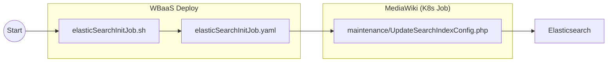
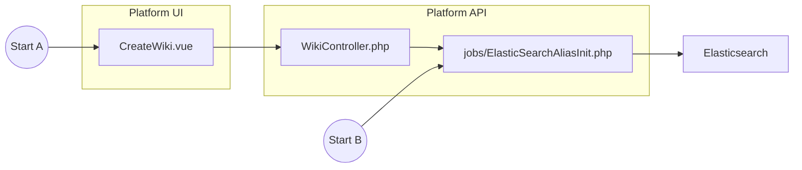

# CirrusSearch and Elasticsearch

Due to performance issues associated with hosting thousands of CirrusSearch-enabled Wikibases in a single Elasticsearch cluster, we have opted to use a single set of indices for all Wikibases and share access to them via Elasticsearch aliases. This is the only cost-effective solution available to us that also allows us to keep up with our current growth estimates.

The gist of it is that we create a single set of indices for all Wikibases using CirrusSearch's built-in maintenance scripts for index creation. Then, we use our Platform API to create aliases in Elasticsearch via cURL for each of our Wikibases, with each alias pointing to the same single set of indices. Since each document created by CirrusSearch automatically contains a field corresponding to the Wikibase's name, our aliases can reuse this field to restrict incoming queries only to the documents of the target Wikibase.

This also keeps us better aligned with Elasticsearch's recommendation of having fewer large indices as opposed to many small indices: https://www.elastic.co/guide/en/elasticsearch/reference/current/size-your-shards.html#shard-size-recommendation.

When starting from scratch with a new Elasticsearch cluster, you will first need to [create a shared index](#shared-index-creation), then manually [alias any existing Wikibases](#manually-b) afterwards.

## Shared Index Creation



Before creating the shared index, you will need to have created at least one Wikibase instance. Then it is as simple as running the `elasticSearchInitJob.sh` script found in `k8s/helmfile/jobs`. This only needs to be done once, after creating a new Elasticsearch cluster.

Configuration:

- `WBS_DOMAIN`: domain of any existing Wikibase
- `CLUSTER_NAME`: Elasticsearch cluster's name (as configured for MediaWiki)
- `MW_CIRRUSSEARCH_INDEX_BASE_NAME`: shared index's prefix (as configured for Platform API)

For example:

```sh
export WBS_DOMAIN=andrew.wikibase.cloud
export CLUSTER_NAME=default
export MW_CIRRUSSEARCH_INDEX_BASE_NAME=wiki_1
./elasticSearchInitJob.sh
```

## Alias Creation



#### Automated (A)

Aliases will be created automatically by the Platform API for any Wikibases created after the shared index was created.

#### Manually (B)

For any preexisting Wikibases, you will need to manually initiate the aliasing process for each. This can done by creating a Platform API job using Artisan, which in turn creates an `ElasticSearchAliasInit` job for a specific Wikibase.

Configuration:

- `wiki`: target Wikibase's id

For example:

```sh
kubectl exec deployments/api-scheduler -- bash -c "php artisan job:dispatchNow ElasticSearchAliasInit $wiki"
```

## Example Alias

```json
{
  "index": "wiki_1_content_first",
  "alias": "mwdb_3d5a2f31b4_content",
  "routing": "mwdb_3d5a2f31b4_content",
  "filter": {
    "prefix": {
      "wiki": "mwdb_3d5a2f31b4-"
    }
  }
}
```
## Implications

Changes that affect how data is indexed or analyzed (i.e. that would normally require rebuilding a single wiki's index) require creating new shared indices and re-indexing all Wikibases into the new indices.
This will require some form of migration to ensure that existing data is properly backfilled and that aliases continue to point to the correct indices during the transition.
